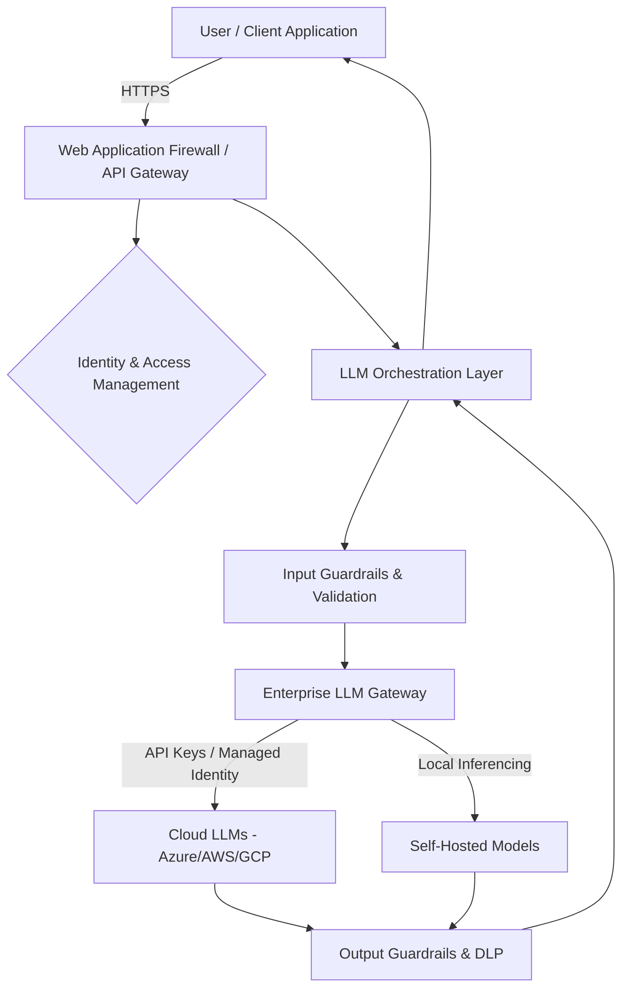

```mermaid
graph TD
    User[User / Client Application] -->|HTTPS| WAF[Web Application Firewall / API Gateway]
    WAF --> IDP{Identity & Access Management}
    WAF --> Orch[LLM Orchestration Layer]
    Orch --> GuardIn[Input Guardrails & Validation]
    GuardIn --> LLMGW[Enterprise LLM Gateway]
    LLMGW -->|API Keys / Managed Identity| CloudLLM[Cloud LLMs - Azure/AWS/GCP]
    LLMGW -->|Local Inferencing| LocalLLM[Self-Hosted Models]
    CloudLLM --> GuardOut[Output Guardrails & DLP]
    LocalLLM --> GuardOut
    GuardOut --> Orch
    Orch --> User
```
